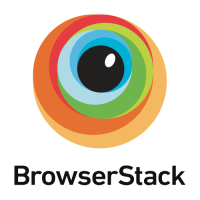
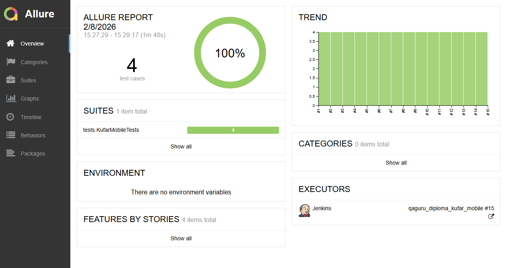
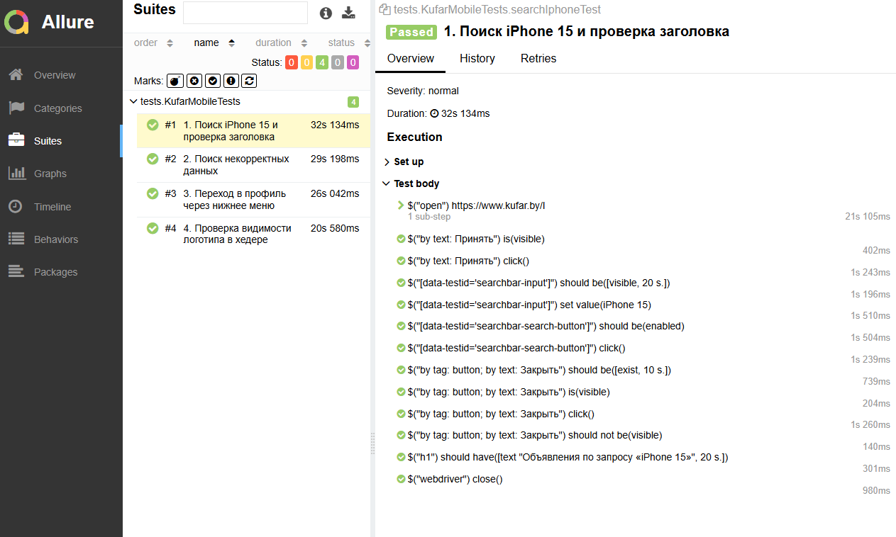
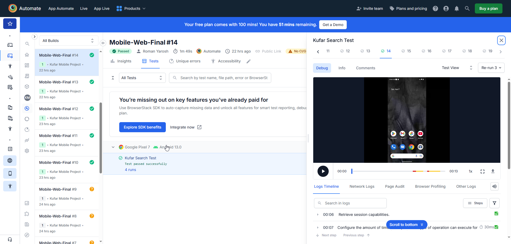
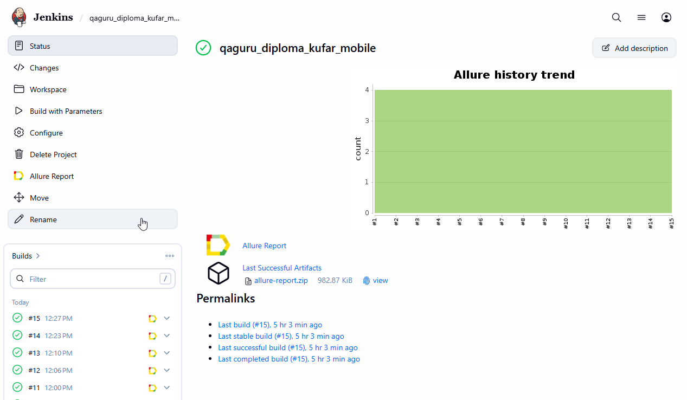
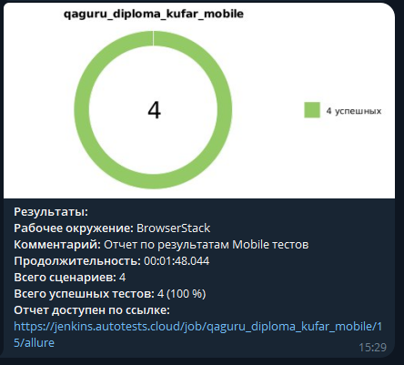

# Проект по автоматизации тестирования мобильной версии сайта Kufar.by (Mobile Web) [Kufar](https://www.kufar.by/l) 

>Куфар (Kufar) — это крупнейшая в Беларуси онлайн-площадка объявлений, где пользователи покупают и продают новые и б/у товары, недвижимость, автомобили, а также предлагают услуги. Ежемесячно сайт посещают более 5 миллионов пользователей.

## 🧾 Содержание

- [Описание проекта](#-описание-проекта)
- [Стек технологий](#-стек-технологий)
- [Архитектура решения](#-архитектура-решения)
- [Реализованные проверки](#-реализованные-проверки)
- [Результаты тестирования](#-результаты-тестирования)

## 📌 Описание проекта

Главная особенность — использование реальных мобильных устройств в облаке **BrowserStack** вместо эмуляторов. Это позволяет проверять поведение сайта в условиях, максимально приближенных к пользовательским.

## 🛠 Стек технологий

   
   
   
   
   
    
   
   
   

-  **Язык:** Java  
-  **Фреймворк:** Selenide
-  **Тестовый запуск:** JUnit 5 
-  **Для работы с BrowserStack:** RemoteWebDriver 
-  **CI/CD:** Jenkins  
-  **Отчеты:** Allure Report  
-  **Уведомления:** Telegram Bot  

## 🏗 Архитектура решения

В проекте реализован кастомный драйвер `BrowserstackDriver` (интерфейс `WebDriverProvider`). Это позволило гибко настроить сессию:
-  **Устройство:** Google Pixel 7
-  **ОС:** Android 13.0
-  **Браузер:** Chrome (Mobile Web)

       public WebDriver createDriver(@Nonnull Capabilities capabilities) {
       MutableCapabilities caps = new MutableCapabilities();

        caps.setCapability("browserName", "chrome");

        HashMap<String, Object> bstackOptions = new HashMap<>();
        bstackOptions.put("userName", PropertyReader.getProperty("bs.user"));
        bstackOptions.put("accessKey", PropertyReader.getProperty("bs.key"));

        bstackOptions.put("deviceName", "Google Pixel 7");
        bstackOptions.put("osVersion", "13.0");
        bstackOptions.put("realMobile", "true");

        bstackOptions.put("projectName", "Kufar Mobile Project");
        bstackOptions.put("buildName", "Mobile-Web-Final");
        bstackOptions.put("sessionName", "Kufar Search Test");

        caps.setCapability("bstack:options", bstackOptions);

        try {
            return new RemoteWebDriver(new URL("https://hub-cloud.browserstack.com/wd/hub"), caps);
        } catch (MalformedURLException e) {
            throw new RuntimeException("Ошибка в URL BrowserStack", e);
        }
       }

## ✅ Реализованные проверки

-  Поиск товара.
-  Обработка некорректных результатов.
-  Мобильная навигация.
-  Проверка видимости логотипа.

## 📊 Результаты тестирования

### 1. Отчетность в Allure
   Для каждого теста в Allure формируется подробный отчет с описанием шагов. Благодаря Selenide, в отчет автоматически прикрепляются скриншоты и исходный код страницы в случае падения.

   

 

### 2. Запуск в BrowserStack
   Все тесты проходят в облаке на реальном устройстве. В панели BrowserStack Automate сохраняется видеозапись каждого прогона, логи устройства и сетевые логи.

 

 

### 3. CI/CD в Jenkins
   Сборка проекта автоматизирована в Jenkins. Параметры доступа к облаку передаются через среду окружения, обеспечивая безопасность данных.

 

### 4. Уведомления в Telegram
   После завершения тестов Jenkins автоматически отправляет отчет в Telegram-бот. Сообщение содержит краткую статистику (кол-во тестов, результат) и ссылку на подробный Allure-отчет.

 
